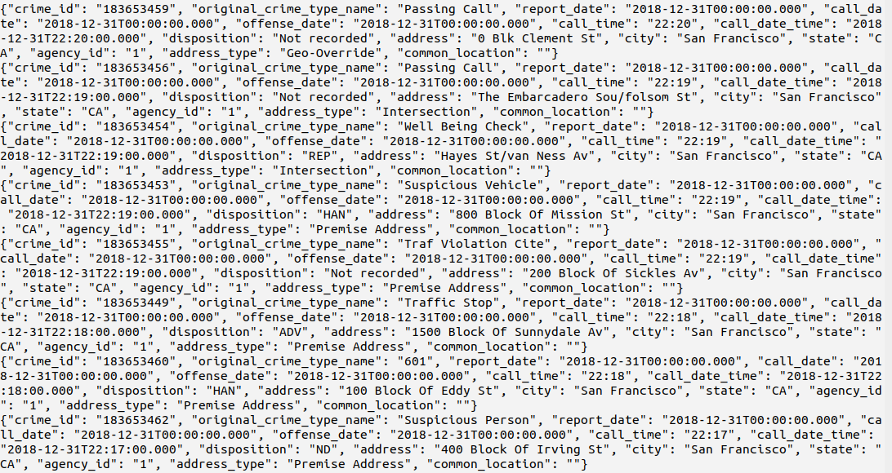
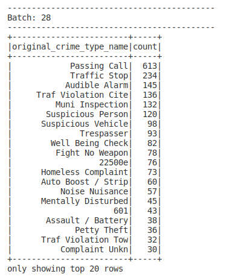
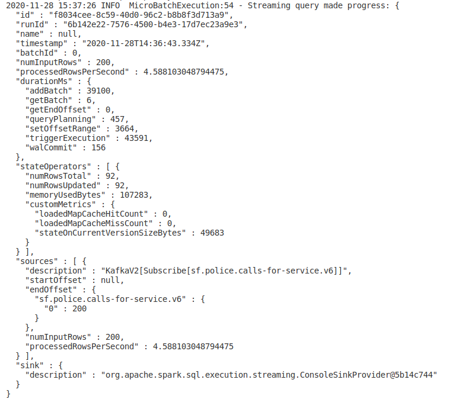
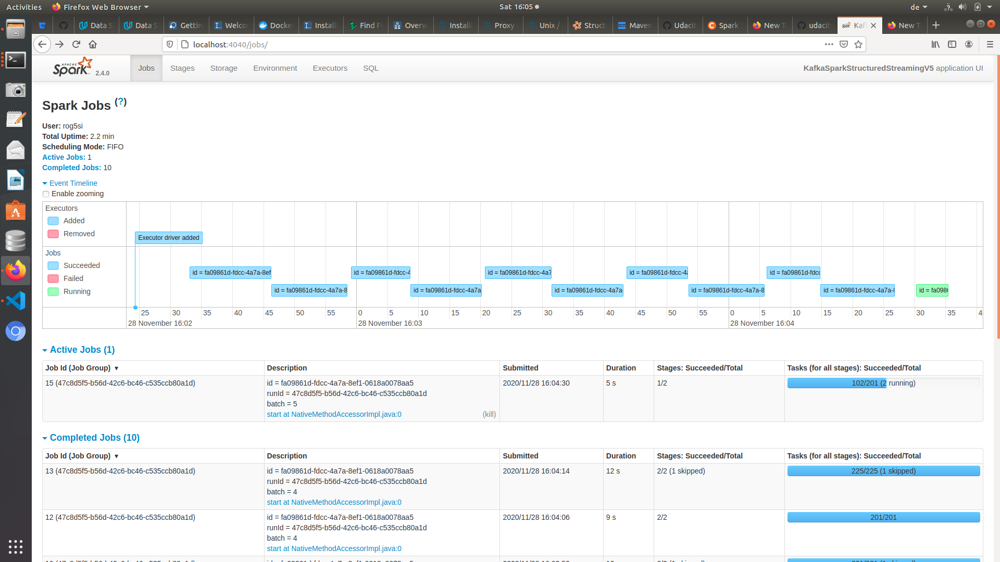

# Project "SF Crime Statistics with Spark Streaming"

Context: Udacity Streaming Nanodegree  
Author: Rostislav Rogov  
Date: 29.11.2020  

## Step 1: Kafka Producer and Consumer

Screenshot of kafka-consumer-console output

## Step 2: Spark Structured Streaming

Screesnhot of aggregation results

Screenshot of the Progress Reporter

Screensoht of Spark UI

## Step 3: Questions

1. _How did changing values on the SparkSession property parameters affect the throughput and latency of the data?_

    The trigger option enables you to control the latency and throughput of the job. The latency is bound to the time it takes to launch a job plus batch time. The execution mode is defined by the trigger specified, so `trigger(processingTime = “30 seconds”)` used in code is a microbatch query where the batch interval (the time interval between batch starts) is 30 seconds. Reducing that time to 0 seconds lets Spark start batches as soon as it can.
    
    The Kafka producer setting in line `NewTopic(self.topic_name, num_partitions=1, replication_factor=1)` allows to increase the number of partitions (e.g. 4), so that I/O parallelism can be achieved. If enabled (e.g. 4), it can be used on consumer side, like Spark's `spark.default.parallelism` and `spark.streaming.kafka.maxRatePerPartition`, the number of cores `.master("local[4]")` set to 4 enables parallel processing of those 4 partitions and would increase the throughput. 

    `.config("spark.default.parallelism",2)` Default number of partitions in RDDs returned by transformations like join, reduceByKey, and parallelize when not set by user.

    `.master("local[*]")` lets spark use all available cores (for 1 core `[1]`). In case of my VM with 4 cores it did help to reduce the job duration from around 12 seconds on single core to around 8 seconds on 4 cores. 

    `.config("spark.driver.memory","2g")` sets the driver memory, no effect on local VM, the job duration stayed around 8 seconds (default was around 400Mb)

2. _What were the 2-3 most efficient SparkSession property key/value pairs? Through testing multiple variations on values, how can you tell these were the most optimal?_

    The Kafka producer generates 1 message per seconds (see the line `time.sleep(1)` in code), so the main concern is that the spark streaming app should be able to process that throughput. According to `processRowsPerSecond` in Progress Report the app handles 4.58 messages per second, so the condition is met.  
    The setting `.option("maxOffsetsPerTrigger", 200)` defines the maximum number of messages that would be processed at each trigger. The trigger in aggregation operation itself `.trigger(processingTime="30 seconds")` is thrown  every 30 seconds, so the application hat 30 seconds to process 200 messages (theoretically 200/30 it should process 6.67messages/seconds, practically 4.58 as in report). Both settings should build a theoretical throughput higher than the assumed Kafka producer (now fixed at 1 message/s).
    The Spark UI shows the job duration around 8 seconds, there is no warning in submitted job that the consumer is lagging behind the producer's data.

## Sources

- https://spark.apache.org/docs/latest/configuration.html
- pyspark SparkSession properties https://spark.apache.org/docs/latest/api/python/pyspark.sql.html?#pyspark.sql.SparkSession
- Execution Mode https://medium.com/@sayatsatybaldiyev/apache-spark-continuous-processing-streaming-87b92f329ea5
- Spark Trigger otpions https://dzone.com/articles/spark-trigger-options 